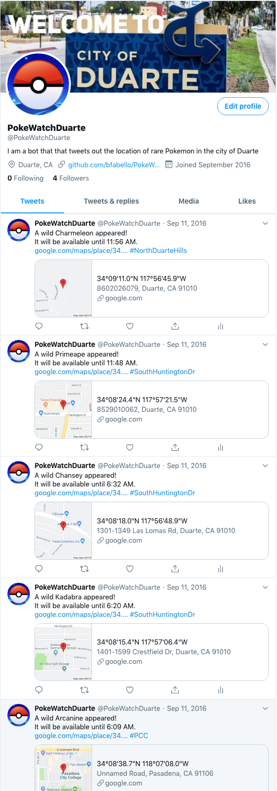

# PokeWatchDuarte
A Pokemon Go twitter bot that implements Pokemon Go's API (unofficial) to scan a section of my hometown of Duarte, CA to find rare Pokemon. Automated tweets would be sent out with the name of the Pokemon, time of spawn expiration, and their percise coordinates with a detailed google map view of its exact location. 

This project came about from my fasination of Pokemon Go during the summer of 2016 when it first came out with the combination of my passion of coding. I put the two together for a fun summer project. This program is a contribution to an open source github repo from user bunzosteele. Credits out to him for the original codebase. 

## Installation (MacOS)

Use the package manager [brew](https://brew.sh/) to install mono

```bash
brew install mono
```

Run msbuild to build project files

```bash
msbuild 
```

Move Configuration.json file into /PokewatchLauncher/bin/Debug/

```bash
cp Configuration.json ~/PokeWatch/PokewatchLauncher/bin/Debug
```

Run PokewatchLauncher.exe in /PokewatchLauncher/bin/Debug/

```bash
mono PokewatchLauncher.exe
```

## Screenshots

PokeWatchDuarte Twitter Feed



Google Maps View


Configuration Generator


Command Line Console


## Link
https://twitter.com/PokeWatchDuarte

## Credits
https://github.com/bunzosteele/PokeWatch/releases
https://reddit.com/r/pokewatch

